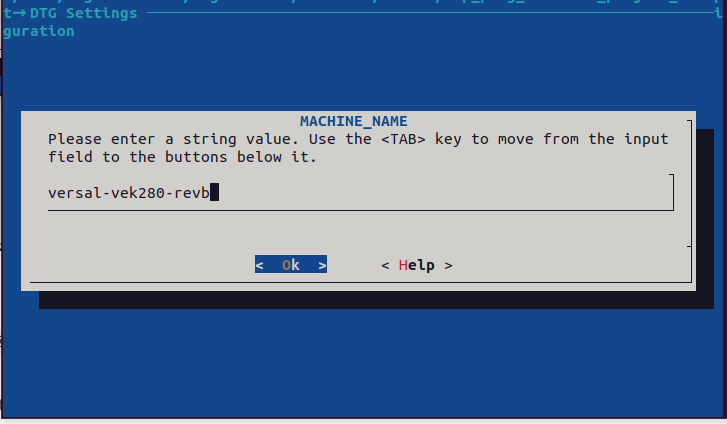
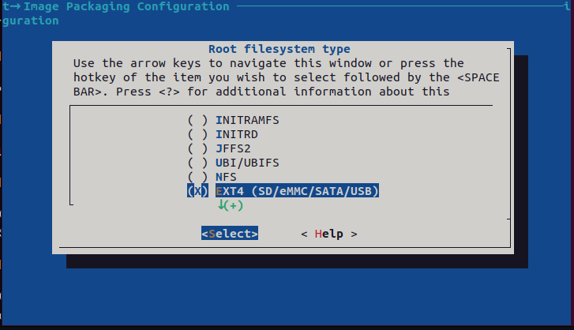
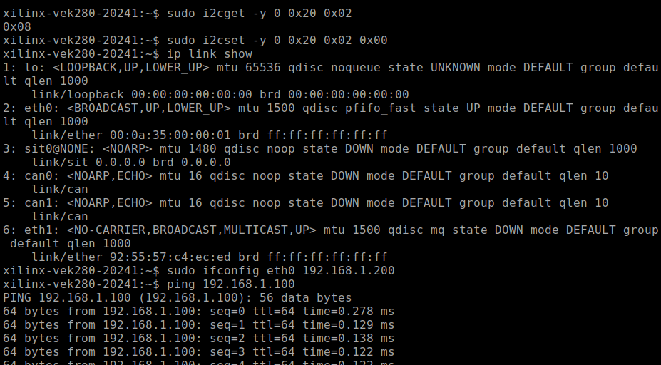

# Versal AXI 10G/25G Ethernet Subsystem

## Design Summary
This project is a AXI 10/25G Ethernet Subsystem based example design which targets VEK280 device.

## Required Hardware

Here is a list of the required hardware to run the example design.
- VEK280 Eval Board
- 10G Supported Ethernet Cable
- 10G supported SFP module
- A host machine or another SFP supported board connected to VEK280 through the cable

## Required Software
- Vivado 2024.1
- Petalinux 2024.1
- VEK280 BSP

BSP Download link: https://www.xilinx.com/support/download/index.html/content/xilinx/en/downloadNav/embedded-design-tools/2024-1.html

## Build Instructions

### Vivado:

Enter the 'scripts' directory. From the command line run the following:

```
vivado -source *top.tcl
```

The Vivado project will be built in the `/hardware/pl_10_ethernet/pl_10g_ethernet_hw` directory.
The xsa will be exported to `/hardware/xsa` 

### PetaLinux:

Enter the `petalinux` directory and execute the following commands:

- Source the Petalinux tools.

- To create Petalinux Project, run the following
```
petalinux-create -t project -s <PATH-TO-BSP> -n vek280_ethernet
```

Using BSP is not mandatory but recommended. You can also create the project using basic Versal template.

- Goto project directory
```
cd vek280_ethernet
```

- To get xsa 
```
petalinux-config --get-hw-description ../../hardware/xsa/sfp_1g_ethernet_vek280_wrapper.xsa
```

- In the Petalinux System Configuration make the following changes:
`DTG Settings -> MACHINE_NAME -> versal-vek280-revb`



`Image Packaging Configuration -> Root filesystem type -> EXT4`



Exit the System Configuration

- Goto rootfs and make following changes.
`petalinux-config -c rootfs`

`Filesystem Packages -> base -> i2c-tools -> [x] i2c-tools`

i2c tools are required to toggle SFP_TX_DISABLE signal in VEK280.

Exit the rootfs config.

- Build the project
```
petalinux-build
```

- Create BOOT.BIN
```
petalinux-package boot --format BIN --plm --psmfw --u-boot --dtb -o ./images/linux/BOOT.BIN --force
```

- Create wic image
```
petalinux-package wic
```

Wic Image is found inside images/linux directory

- Burn the image on a SD Card and Boot the VEK280. Boot log is provided in the bootlog.md

## Board Testing

- Boot the VE280 using SDCard.
- Login using credentials `petalinux` and `petalinux`
- Execute the following command to set SFP_TX_DISABLE `LOW`
```
sudo i2cset -y 0 0x20 0x02 0x00
```

You should see the following logs in the screen:



If the above logs are not displayed you can try replugging the SFP Connector or disable & reenable the Ethernet Interface.
```
sudo ifconfig eth1 down
sudo ifconfig eth1 up
```
Also toggle System Reset POR_B after setting the i2c register if the renabling of eth1 doesnot UP the Link.

You can also check if the link is up using this command:
```
ip link show
```


