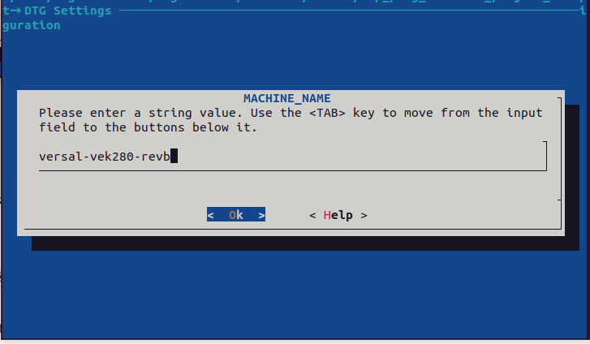
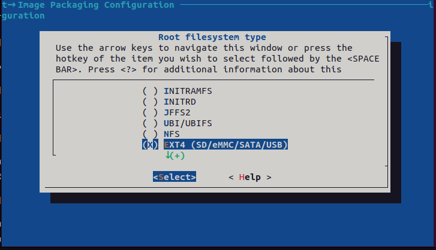
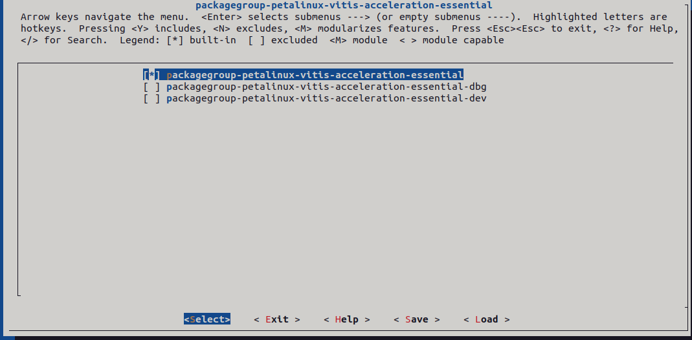
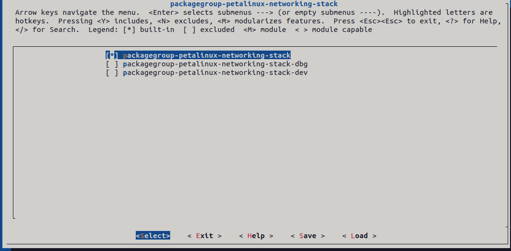
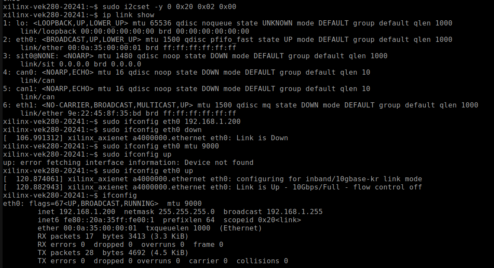
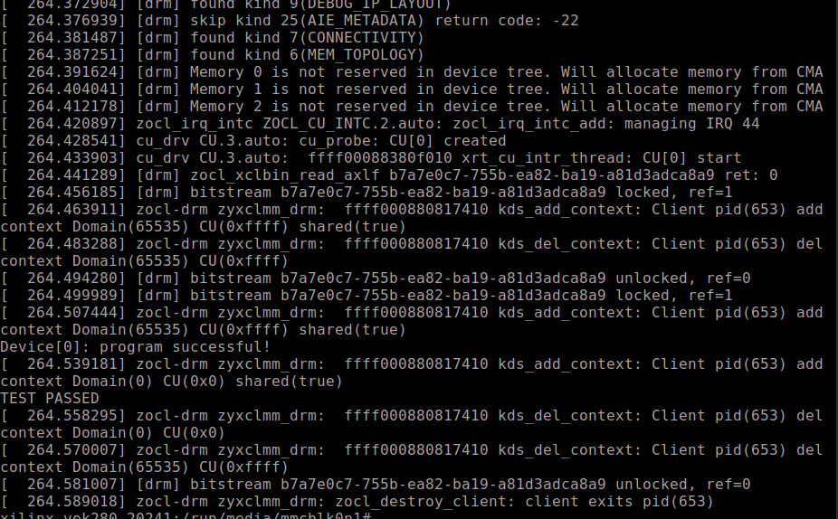
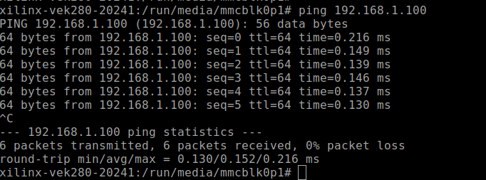
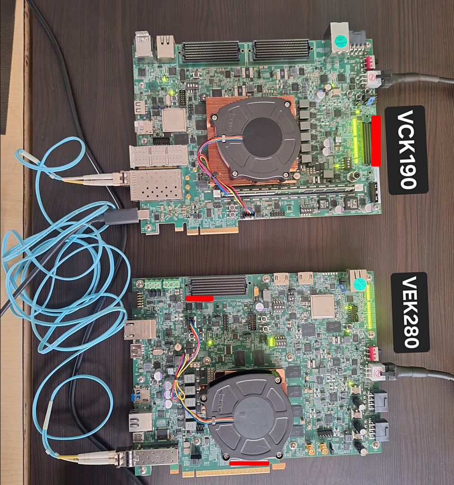

# Versal Base Platform with AXI 10G/25G Ethernet Subsystem

## Design Summary
This project is a Vitis Base Platform with AXI 10/25G Ethernet Subsystem targets VEK280 device. We will accelerate a simple Vector Addition Example and test the 10G connection as well.

## Required Hardware

Here is a list of the required hardware to run the example design.
- VEK280 Eval Board
- 10G Supported Ethernet Cable
- 10G supported SFP module
- A host machine or another SFP supported board connected to VCK190 through the cable

## Required Software
- Vivado 2024.1
- Petalinux 2024.1
- Versal Common Image 2024.1

SD Image to Test: [SD Image Download Link]()

Pre-built Rootfs: [RootFS Download Link]()

[Versal Common Image - Download Link](https://www.xilinx.com/support/download/index.html/content/xilinx/en/downloadNav/embedded-design-tools.html)

## Build Instructions

### Vivado:

Enter the 'scripts' directory. From the command line run the following:

```
vivado -source *top.tcl
```

The Vivado project will be built in the `/hardware/pl_10_ethernet/pl_10g_ethernet_hw` directory.
The xsa will be exported to `/hardware/xsa` 

### Vitis:

Goto `vitis` directory and execute:
```
vitis -w .
```

Follow the instructions given by Xilinx: [Vitis Platform Tutorial Link](https://github.com/Xilinx/Vitis-Tutorials/blob/2024.1/Vitis_Platform_Creation/Design_Tutorials/03_Edge_VCK190/step2.md)

In the above process replace the RootFS and device tree with the provided one.
You can also regenerate device-tree using either DTG or Petalinux.

The provided RootFS already contains the i2cset & Vitis Acceleration packages needed for this project. 

If you want to customize Petalinux you can also follow this tutorial: [Petalinux Customization Tutorial Link](https://github.com/Xilinx/Vitis-Tutorials/blob/2024.1/Vitis_Platform_Creation/Feature_Tutorials/02_petalinux_customization/README.md)


### (Optional)PetaLinux:
##### If you are using provided RootFS and Device-Tree these steps are optional.
##### Minimal Petalinux build steps required for this project if you want to cutomize the Petalinux.

Enter the `petalinux` directory and execute the following commands:

- Source the Petalinux tools.

- To create Petalinux Project, run the following
```
petalinux-create project --template versal --name pl_10g_base_platform
```


- Goto project directory
```
cd pl_10g_base_platform
```

- To get xsa 
```
petalinux-config --get-hw-description ../../hardware/xsa/pl_10g_base_platform.xsa
```

- In the Petalinux System Configuration make the following changes:
`DTG Settings -> MACHINE_NAME -> versal-vek280-revb`



`Image Packaging Configuration -> Root filesystem type -> EXT4`



Exit the System Configuration

- Goto rootfs and make following changes.
`petalinux-config -c rootfs`

`Filesystem Packages -> base -> i2c-tools -> [x] i2c-tools`

i2c tools are required to toggle SFP_TX_DISABLE signal in VEK280.

Enable Vitis Acceleration Packages:
`Petalinux Package Groups -> packagegroup-petalinux-vitis-acceleration-essential -> [x] packagegroup-petalinux-vitis-acceleration-essential`




To get iperf enable Network Stack Package group:
`Petalinux Package Groups -> packagegroup-petalinux-networking-stack -> [x] packagegroup-petalinux-networking-stack`




Exit the rootfs config.

- Build the project
```
petalinux-build
```

- Create BOOT.BIN
```
petalinux-package boot --format BIN --plm --psmfw --u-boot --dtb -o ./images/linux/BOOT.BIN --force
```

## Board Testing

- Boot the VE280 using SDCard.
- Login using credentials `petalinux` and `petalinux`
- Execute the following command to set SFP_TX_DISABLE `LOW`
```
sudo i2cset -y 0 0x20 0x02 0x00
```

You should see the following logs in the screen:



If the above logs are not displayed you can try replugging the SFP Connector or disable & reenable the Ethernet Interface.
```
sudo ifconfig eth1 down
sudo ifconfig eth1 up
```
Also toggle System Reset POR_B after setting the i2c register if the renabling of eth1 doesnot UP the Link.

You can also check if the link is up using this command:
```
ip link show
```

To run Vector Addition:

```
sudo su
```
```
cd /run/media/mmcblk0p1
./vadd_host binary_container_1.xclbin
```

Output:




Ping Test:



Board Setup:



