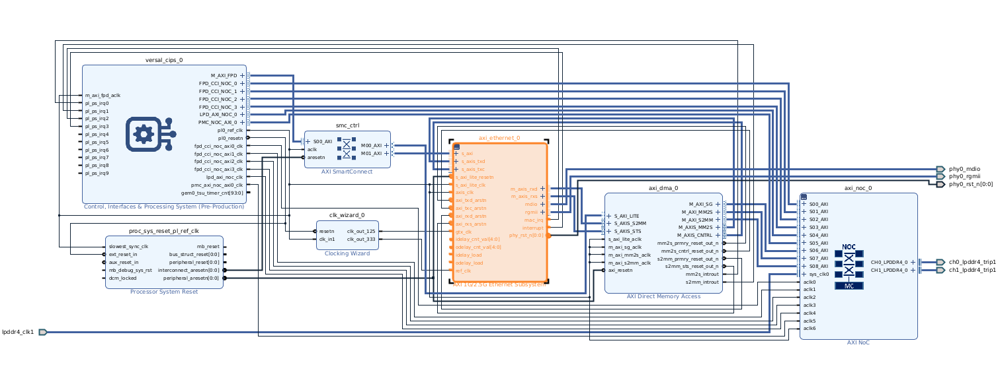

# Versal AXI 1G/2.5G Ethernet Subsystem Bringup in VEK280

This project contains RGMII PL ETH bringup using AXI 1G/2.5G Ethernet Subsystem IP in VEK280 board.

## Directory Structure

```
scripts/
├── Makefile              # Top-level Makefile, calls hw/ and sw/
├── hw/                    # Vivado hardware build
│   ├── Makefile
│   ├── pl_1g_eth_project.tcl   # Project creation / build script
│   ├── pl_1g_eth_bd.tcl        # Block design script
│   ├── constraints/
│   │   └── pl_eth_vek280.xdc
│   ├── log/                    # Vivado log/journal (created by the build)
│   └── xsa/                    # Exported hardware platform (pl_1g_eth.xsa)
├── sw/                    # PetaLinux SDT build
│   ├── Makefile
│   ├── create_petalinux.sh     # Create, configure, build, package PetaLinux
│   ├── sdtgen.sh                # Generates the SDT from hw/xsa/pl_1g_eth.xsa
│   ├── system-user.dtsi         # User devicetree overlay applied to the project
│   └── sdt/                     # Generated system device tree (SDT)
└── sd_image/               # Final wic image, copied here after the sw build
```

## Prerequisites

- VIVADO 2025.2
- Petalinux 2025.2
- VEK280 BSP file(xilinx-vek280-v2025.2-11160223.bsp)
- VEK280 Board
- Copper Ethernet Cable(RJ45)

## Build instructions

### Hardware only

```
make hw
```

### Software only

Requires the hardware build to have completed before and a BSP file path.

```
make sw BSP_PATH=<path to BSP file>
```
Generates the SDT, creates and configures the Petalinux project, builds it, packages boot components and the wic image, and copies the wic image to `sd_image/` folder.

### Full build (hw+sw)

```
make all BSP_PATH=<path to BSP file>
```
Builds both hardware and petalinux software along with wic image.

## Output

- `hw/xsa/pl_1g_eth.xsa`: exported hardware.
- `sw/sdt`: generated system device tree.
- `sd_image/petalinux-sdimage.wic`: final SD card image.


## Block Design


## Log
```
xilinx-vek280-20252:~$ ifconfig
end0: flags=4163<UP,BROADCAST,RUNNING,MULTICAST>  mtu 1500
        inet 192.168.1.156  netmask 255.255.255.0  broadcast 192.168.1.255
        inet6 2400:1a00:4b2b:ce5e:20a:23ff:fe00:0  prefixlen 64  scopeid 0x0<global>
        inet6 fe80::20a:23ff:fe00:0  prefixlen 64  scopeid 0x20<link>
        ether 00:0a:23:00:00:00  txqueuelen 1000  (Ethernet)
        RX packets 12  bytes 1867 (1.8 KiB)
        RX errors 0  dropped 3  overruns 0  frame 0
        TX packets 17  bytes 2199 (2.1 KiB)
        TX errors 0  dropped 0 overruns 0  carrier 0  collisions 0

end1: flags=4099<UP,BROADCAST,MULTICAST>  mtu 1500
        ether c6:13:5f:e7:df:78  txqueuelen 1000  (Ethernet)
        RX packets 0  bytes 0 (0.0 B)
        RX errors 0  dropped 0  overruns 0  frame 0
        TX packets 0  bytes 0 (0.0 B)
        TX errors 0  dropped 0 overruns 0  carrier 0  collisions 0
        device interrupt 38  

lo: flags=73<UP,LOOPBACK,RUNNING>  mtu 65536
        inet 127.0.0.1  netmask 255.0.0.0
        inet6 ::1  prefixlen 128  scopeid 0x10<host>
        loop  txqueuelen 1000  (Local Loopback)
        RX packets 80  bytes 6080 (5.9 KiB)
        RX errors 0  dropped 0  overruns 0  frame 0
        TX packets 80  bytes 6080 (5.9 KiB)
        TX errors 0  dropped 0 overruns 0  carrier 0  collisions 0

xilinx-vek280-20252:~$ ping 192.168.1.78
PING 192.168.1.78 (192.168.1.78): 56 data bytes
64 bytes from 192.168.1.78: seq=0 ttl=64 time=0.270 ms
64 bytes from 192.168.1.78: seq=1 ttl=64 time=0.129 ms
64 bytes from 192.168.1.78: seq=2 ttl=64 time=0.139 ms
64 bytes from 192.168.1.78: seq=3 ttl=64 time=0.118 ms
64 bytes from 192.168.1.78: seq=4 ttl=64 time=0.164 ms
64 bytes from 192.168.1.78: seq=5 ttl=64 time=0.137 ms
64 bytes from 192.168.1.78: seq=6 ttl=64 time=0.146 ms
[   48.188117] systemd-journald[203]: Time jumped backwards, rotating.
^C
--- 192.168.1.78 ping statistics ---
7 packets transmitted, 7 packets received, 0% packet loss
round-trip min/avg/max = 0.118/0.157/0.270 ms
xilinx-vek280-20252:~$ 

```

## Manual Steps
- Coming soon
